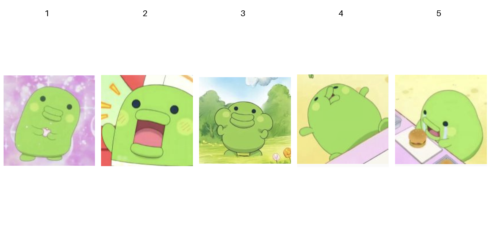

# 真人转大嘴吉 · Kuchipatchi Skill

把真人照片中的配色、表情、动作与场景，转译成二维动漫里的大嘴吉。

这是用于支持内置 `image_gen` 图像生成工具的 Codex 环境的技能包。它保留圆鼓头身、黑点眼睛、厚嘴唇和短手脚；不会把真人脸、发型或服装贴到角色上。

## 固定造型参考



上图是技能使用的固定角色参考板，**不是用户照片，也不是转换效果对比图**。五张独立原图一并保留，参考板由它们等比例拼接而成。

## 使用

将本仓库安装为个人技能：

```sh
mkdir -p ~/.agents/skills
git clone https://github.com/Corakong2003/generate-person-kuchipatchi.git ~/.agents/skills/generate-person-kuchipatchi
```

目标目录已存在时先检查现有安装，避免覆盖自己的修改。技能未出现在列表时，重启 Codex。安装目录依据 [OpenAI 官方技能文档](https://learn.chatgpt.com/docs/build-skills)。

在支持图像生成的对话中，附上你有权使用的真人照片，然后输入：

```text
使用 $generate-person-kuchipatchi，把我提供的真人照片转成大嘴吉，
按照片选择角色颜色和表情，并将原场景改编为二维动漫。
```

也可以明确指定角色颜色。多人照片请指出需要转换的目标人物。

默认每张单人照片生成一张有背景的场景图，随后检查造型和表情；明显偏离时修正一次。参考图、真人输入或图像生成工具不可用时，技能会停止并说明原因，不退化为纯文字生成。

## 配色与表情规则

- 颜色来自照片整体色调、衣服颜色与可见氛围；用户指定颜色优先。
- 表情依据照片中可见的笑、哭或中性表情，不从外貌推断性格或身份。
- 场景、动作和视角保留原照片的关系，并适应短手脚角色的结构。
- 保持二维动画画风；不添加真人发型、衣服、眼镜、帽子和写实五官。

完整生成与验收规则见 [SKILL.md](SKILL.md)。

## 隐私

**禁止将真人照片或其他隐私上传到本仓库。**

真人照片仅在当次对话中作为输入，并会发送给当前图像生成服务处理；本技能不是离线照片处理器。请按该服务的数据政策选择输入。

公开内容限定为技能说明、角色参考图，以及获得分享授权并完成隐私检查的大嘴吉成品。不要提交真人对比图、身份对应表、聊天记录、私人联系方式、凭据或本机路径。图片背景中的可识别文字、二维码与地点信息也需要检查，清除 EXIF/XMP 等元数据。

`.gitignore` 默认忽略未明确放行的文件。添加示例前逐张查看，仅为通过检查的具体文件放行；不要使用 `git add -f` 绕过规则。忽略规则不能清除已提交的历史。Issue 和 PR 也不要附上真人照片。

## 仓库结构

```text
SKILL.md                 生成和验收规则
agents/openai.yaml       技能名称及默认提示
assets/reference-*.png   五张固定参考图及合并参考板
LICENSE                  原创说明的 MIT 许可
ASSET_LICENSE.md         角色和图片的许可边界
```

## 许可

原创技能说明、配置和文档使用 [MIT License](LICENSE)。角色、商标和参考图不纳入 MIT 授权，见 [素材说明](ASSET_LICENSE.md)。本项目是非官方爱好者项目，不代表相关角色权利方。
